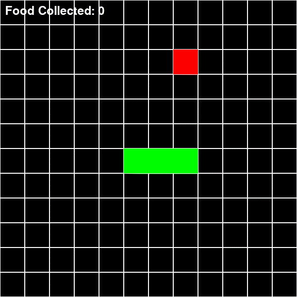
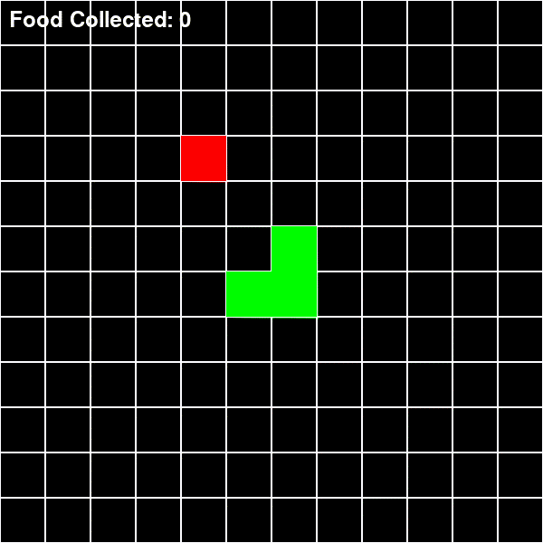
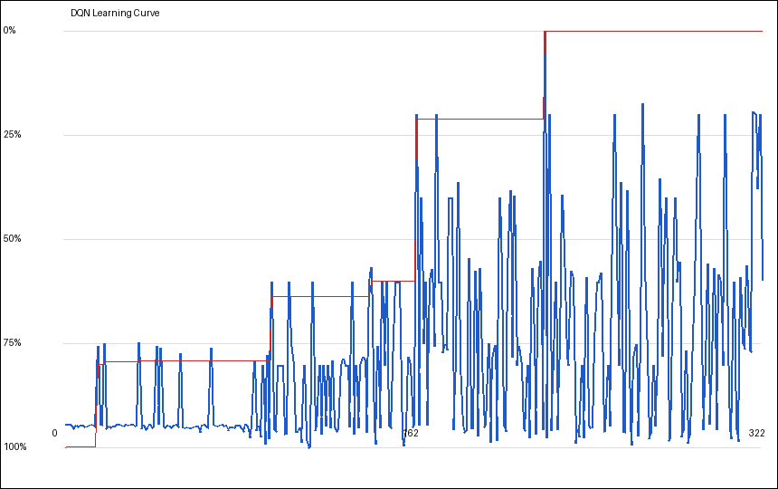

# Snake DQN

A Snake game where a Deep Q-Network (DQN) learns to play by itself, built from scratch with **PyTorch** and a **PyGame** GUI. No RL framework — the whole DQN (replay buffer, target network, ε-greedy, Bellman update) is written from the ground up.

## Demo

| Before training (random) | After training (DQN) |
|:---:|:---:|
|  |  |

**Learning Curve** (real run: best reward climbs from −10 to +37 in 300 episodes)



Verified DQN results on a trained model (100 games, greedy):

| Metric | Value |
|---|---|
| Average score | 3.87 |
| Best score | 25 |
| Games that ate food | 76 / 100 |
| Average reward | +32.6 |

## Quick Start

```bash
pip install -r requirements.txt

# Train the DQN agent (saves best_snake.pth)
python main.py train --episodes 5000

# Train the PPO agent (saves ppo_snake.pth)
python main.py train-ppo --episodes 5000

# Test a trained model
python main.py test

# Watch the trained agent play
python main.py watch

# Play yourself (human mode)
python main.py play
```

All commands also work directly via `scripts/train.py`, `scripts/test.py`, etc.

### Train on Google Colab (free GPU/CPU)

```python
!git clone https://github.com/BayanDrp/snake-dqn.git
%cd snake-dqn
!python main.py train --episodes 5000 --save best_snake.pth --log logs/training_log.csv
!python main.py train-ppo --episodes 5000 --save ppo_snake.pth --log logs/ppo_training_log.csv
!python main.py test --model best_snake.pth --episodes 100
from google.colab import files
files.download('best_snake.pth')
files.download('ppo_snake.pth')
files.download('logs/training_log.csv')
files.download('logs/ppo_training_log.csv')
```

## How It Works

- **State**: local vision window around the snake head + current direction
- **Actions**: 3 relative moves — turn left, straight, turn right
- **Rewards**: +10 (eat), −10 (death), −0.01 per step (forces speed)

### DQN (value-based) — implemented

Learn a Q-value per action → act greedily. Small MLP (vision + one-hot direction → Q-values), **replay buffer** (reuse old off-policy data), **target network** (stable Bellman targets), ε-greedy with linear decay.

### PPO (policy-gradient) — implemented

Policy gradient with Actor-Critic: separate Actor (policy) and Critic (value) networks, Categorical policy, clipped surrogate objective (ε=0.2), GAE advantages (λ=0.95), entropy bonus for exploration. On-policy: data used once then discarded.

## DQN vs PPO (the plan)

Same environment, same state/action/reward — two completely different learning families. The goal is to train both and compare learning curves head-to-head:

| | DQN | PPO |
|---|---|---|
| Learns | Q(s,a) values | policy π(a\|s) + value V(s) |
| Data use | Off-policy (replay buffer) | On-policy (fresh rollouts only) |
| Exploration | ε-greedy | stochastic policy sampling |
| Update rule | Bellman target + MSE | clipped surrogate objective |
| Sample efficiency | Better per episode (reuses data) | Worse (data used once) |
| Stability trick | Target network | Clip term |

Expectation on Snake: DQN usually reaches good scores faster per episode because replay reuses transitions; PPO (on-policy, no reuse) needs more episodes and often benefits from denser reward shaping on sparse-reward games like this one.

## Structure

```
main.py            # CLI entry point (train / train-ppo / watch / test / play)
game/
  env.py           # Snake world (gym-style: reset/step)
  render.py        # PyGame GUI renderer
dqn/
  dqn.py           # DQN network (MLP) + ε-greedy action selection
  memory.py        # Replay Buffer
  agent.py         # DQN agent: online + target net, Bellman update, training
ppo/
  network.py       # Actor (policy) + Critic (value) networks
  memory.py        # On-policy rollout buffer + GAE
  agent.py         # PPO agent: clipped objective, entropy bonus, training
scripts/
  train.py         # DQN training loop (--log CSV, --render-every)
  train_ppo.py     # PPO training loop (--log CSV)
  watch.py         # Watch trained agent
  test.py          # Headless evaluation with metrics report
  play.py          # Human playable
  make_plot.py     # DQN learning curve from logs/*
  make_plot_ppo.py # PPO learning curve from logs/*
  train_for_gif.sh # Demo GIF renderer
img/               # Demo GIFs + learning curves
logs/              # Training data (*_log.csv)
```

## Requirements

- Python 3.9+
- torch, numpy, pygame, matplotlib, pillow
- ffmpeg (only for generating the demo GIFs)

## Credits

Built by [Drpisto](https://github.com/Drpisto)